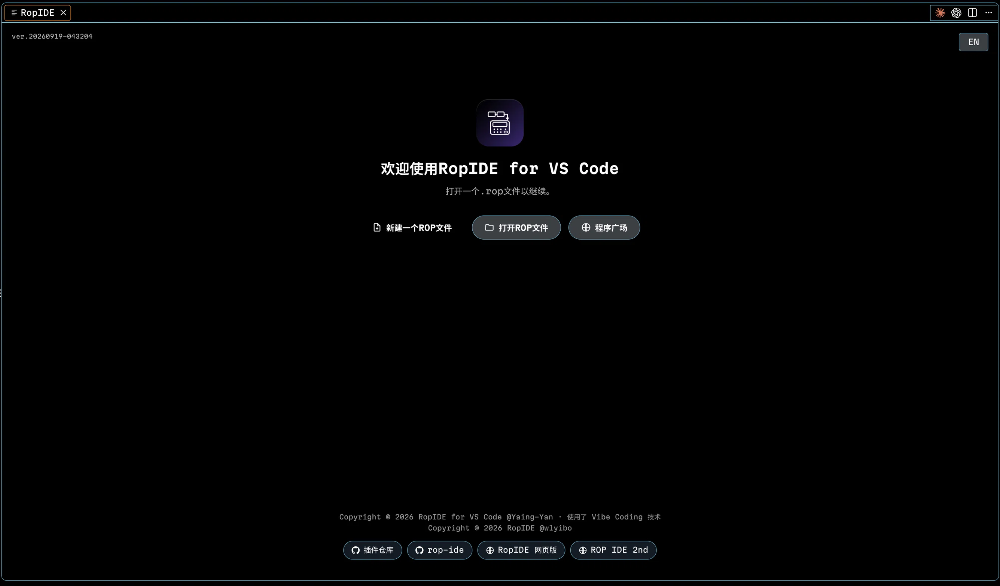

<p align="center">
  
</p>

<h1 align="center">RopIDE for VS Code</h1>

<p align="center">
  A VS Code extension built for <b><code>.rop</code> files</b> — ROP programs for the <b>CASIO fx-991 CN X</b>.
</p>

<p align="center">
  
  
  
  
  
</p>

<p align="center">
  <a href="#screenshot">Screenshot</a> ·
  <a href="#features">Features</a> ·
  <a href="#install--run">Install</a> ·
  <a href="#-overwrite-feature-the-emulator-must-be-started-this-way">Emulator overwrite</a> ·
  <a href="#compile-rules">Compile rules</a> ·
  <a href="#ropide-for-vs-code中文">中文</a>
</p>

---

A `.rop` file is a single JSON object:

```json
{
  "input": "// ...assembly DSL source...",
  "gadgets": [ { "name": "pop-er0", "addr": "121A8", "desc": "赋值 ER0", "tags": [] } ],
  "leftStartAddress": "E9E0",
  "rightStartAddress": "D710",
  "ideVersion": 100
}
```

This extension does **not** touch `.rin` / `gadgets.json` / `config.json` — everything lives inside the single `.rop` file.

## Screenshot

The RopIDE welcome page (shown on startup) — start a new `.rop` file, open an existing one, or browse the program market:

<p align="center">
  
</p>

## Features

When you open a `.rop` file, the editor shows the `input` field's content (not the raw JSON) with full syntax highlighting:

| Syntax | Description |
| --- | --- |
| `// comment` | Gray italic |
| `$name = value;` | Constant definition (cyan name + green value) |
| `#gadget;` / `#-gadget;` | Gadget reference (blue; recognized ones get a background) |
| `[expression]` | Value block (orange; closed ones get a background) |
| `<anchor>` / `<-anchor>` | Address anchor (green; closed ones get a background) |
| `00 11 AA` | Raw hex bytes |

#### Editing & navigation

- **Left / right address gutters** — the line-number gutter on the left shows each line's **left address**; a right gutter shows each line's **right start address**. The current line's addresses are highlighted in both gutters.
- **Status-bar address** — VS Code's status bar shows `L:xxxx R:xxxx` for the cursor position in real time.
- **Cursor → address jump** — a jump box (bottom-right) moves the cursor to any address.
- **Find / replace panel** — `Ctrl+F` opens an in-editor find/replace bar.
- **Comment toggle** — `Ctrl+/` toggles `//` comments (skips empty lines, keeps selection, normalizes the space after `//`).
- **Tab-aligned comments** — pressing Tab aligns the current line's `//` comment with the column used above.
- **Launcher highlight** — *Highlight launcher* (on by default) marks any word containing `launch` (case-insensitive) inside comments, so `// launcher` / `// launcherAddr = D180` stand out.
- **Completion** — type `#` for gadget completion, `$` for defined constants and anchors.

#### Gadgets & disassembly

- **Gadgets panel** — open it from the toolbar: a laid-out list of all gadgets (name, colored tags, address, description) with search, add, edit, delete.
- **Gadget disassembly** — enable *Show gadget disassembly* in Settings and provide a `_disas` file; each gadget then shows the disassembly snippet from its address until `POP PC` / `RT`. Optionally show the same snippet in the **hover tooltip**.
- **Disas browser tab** — the read-only disassembly browser (address input + line-numbered view) is opt-in: turn on *Show Disas tab* in Settings (off by default) and pick a `_disas` file to get it in the side panel. Jump to any address (`0x012D34`, `12D34`, `#gadget;`, …) and it highlights the target line and the nearest terminating `POP PC` / `RT`. The `_disas` path is remembered per `.rop` file.

#### Build & run

- **Compile** — one-click compile from the toolbar, showing a hexdump (16 bytes per row with left/right addresses), with copy-hex / copy-hexdump actions.
- **Overwrite emulator** — from the compile tab you can "overwrite RAM" (inject address, defaults to the left address) and "overwrite launcher" (fixed at `0xD180` by default), writing into the running emulator's memory via CasioEmuMsvc's McpPlugin (MCP, port `3001`).

#### Files, market & welcome

- **New file** — creating a `.rop` file walks you through **file name**, **left address**, **right address**, and the gadgets source (VerF preset / VerC preset / import `gadgets.json` / empty).
- **Market** — browse / search programs on [ropide.pages.dev](https://ropide.pages.dev), Featured / All sections, one-click download (**choose a save path, then it opens**), and publish (name / author / model / description form with expert check). An unread badge appears on the market buttons when new programs are published.
- **Welcome page** — a polished start page (optionally shown on startup) with quick actions, **recent files**, an **update-available badge** that updates the extension in place when clicked (it compares the local build time against the latest `main` commit), and the market dialog.
- **Settings** — UI language (简体中文 / English), the launcher-highlight toggle, the disassembly toggles, the Disas-tab toggle, the startup-welcome toggle and a **Check for updates** button, from the toolbar gear or the side panel.
- **In-place update** — the update check compares your local build time against the latest commit on GitHub `main`; when something newer exists, both the welcome-page badge and the Settings button **update the extension for you** — they run `scripts/self-update.sh` (`.ps1` on Windows) in an integrated terminal, which fetches the latest source, rebuilds and reinstalls the `.vsix`, then offers to reload the window. Nothing is opened in the browser.

## ⚠️ Overwrite feature: the emulator must be started this way

"Overwrite RAM / overwrite launcher" writes memory through CasioEmuMsvc's **McpPlugin** (MCP, `http://127.0.0.1:3001`), so the emulator **must be started from its own directory** (on Linux/macOS the plugin loader only scans the **current working directory** for `CasioEmuMsvc.Plugin.*.so`); otherwise the plugin isn't loaded, port 3001 isn't listening, and overwriting reports "找不到正在运行的 CasioEmuMsvc，或者进程不支持 MCP".

**Correct way to start (important):**

```bash
cd /path/to/CasioEmuMsvc-mcp          # enter the directory that contains the CasioEmuMsvc binary (not its parent!)
./CasioEmuMsvc ../models/fx991cnxfVirtual   # launch with the model directory
```

> Verify: visit `http://127.0.0.1:3001/health` — a `{"status":"ok",...}` response means MCP is ready.
> If the port isn't 3001, change `ropide.casioemuMcpPort` in settings.

## Install / Run

Requires Node.js 18+ and VS Code 1.85+, with the `code` CLI installed
(VS Code command palette → `Shell Command: Install 'code' command in PATH`).

**One-click install (recommended)**: compile → package `.vsix` → install into VS Code:

```bash
./install.sh          # Linux / macOS
install.bat           # Windows (CMD, double-click or command line)
# or Windows PowerShell:
.\install.ps1
```

After installing, reload the VS Code window (`Ctrl+Shift+P` → `Reload Window`),
then open any `.rop` file to enter the RopIDE editor — **no F5 development host needed**.

The install / uninstall scripts draw a small terminal UI (`scripts/ui.sh` on
Linux/macOS, `scripts/ui.ps1` on Windows): an inverse-video title pill centred
slightly above the middle, a subtitle, and a fixed **4-line log area** that
scrolls and fades from bright at the bottom (newest) to dim at the top (oldest),
with the current step / result on the last line. Every command's output streams
into that area live. When the output is **not a terminal** (redirected, CI),
when `NO_COLOR` is set, or when the window is too small, it automatically falls
back to plain line-by-line output instead of emitting cursor-control codes.

Manual steps (equivalent to the scripts above):

```bash
npm install
npm run compile
npm run package                       # produces ropide-vscode-plugin-0.1.0.vsix
code --install-extension ropide-vscode-plugin-0.1.0.vsix --force
```

**Cross-platform packaging** (outputs `ropide-vscode-plugin-<yyyymmdd>.vsix`, works everywhere):

```bash
./build.sh
```

For live debugging after code changes, `F5` still starts the extension development host (the repo ships `.vscode/launch.json`).

**Uninstall**:

```bash
./uninstall.sh          # Linux / macOS
uninstall.bat           # Windows (CMD)
# or Windows PowerShell:
.\uninstall.ps1
```

## Compile rules

The compiler is a faithful port of [rop-ide](https://github.com/WulanOVO/rop-ide)'s `src/parser.js` and ropide-python's `compiler.py`:

- `#gadget;` encodes as 4 bytes (8 hex digits): `h1 h2 h3 h4`, where `h3 = ("0" if allow00 else "3") + addr[0]`, `h4 = "00" / "30"`.
- `[expression]` encodes as little-endian 2 bytes; forward references to `$constants` are supported (deferred back-patch).
- `<anchor>` records the address at the current byte-stream length (right address base; `<-anchor>` uses the left address base).
- Raw hex characters merge directly into the byte stream.
- Gutter / status-bar addresses = start address + byte offset of the current line / cursor.

## Directory structure

```
ropide-vscode-plugin/
├── package.json
├── tsconfig.json
├── build.sh                # Cross-platform packaging: outputs ropide-vscode-plugin-<yyyymmdd>.vsix
├── simply-plugin.sh        # One-line install/uninstall without git clone (Linux/macOS)
├── simply-plugin.bat       # One-line install/uninstall without git clone (Windows)
├── install.sh              # Linux/macOS one-click install script
├── install.ps1             # Windows PowerShell one-click install script
├── install.bat             # Windows CMD one-click install script
├── uninstall.sh            # Linux/macOS uninstall script
├── uninstall.ps1           # Windows PowerShell uninstall script
├── uninstall.bat           # Windows CMD uninstall script
├── icon.png                # Extension icon
├── scripts/
│   ├── ui.sh               # Terminal UI library (bash): inverse title pill + 4-line fading log
│   ├── ui.ps1              # Terminal UI library (PowerShell), same look as ui.sh
│   ├── self-update.sh      # In-place updater launched by the "Update now" buttons (bash)
│   └── self-update.ps1     # In-place updater launched by the "Update now" buttons (Windows)
├── media/
│   ├── banner.png          # README banner (AI-generated)
│   ├── demo.webp           # README screenshot (welcome page)
│   ├── editor.css          # Editor/panel/syntax-highlight styles
│   ├── compiler.js         # Compiler + syntax-highlight parser (parser port)
│   └── editor.js           # Webview main logic (gutters, gadgets, compile, completion, market, settings)
└── src/
    ├── extension.ts          # Activation entry, command registration, new/open files
    ├── ropEditorProvider.ts  # CustomTextEditor provider, status bar, settings & disas sync
    ├── presets.ts            # Built-in VerF / VerC gadget presets
    ├── market.ts             # Market API (ropide.pages.dev)
    ├── marketState.ts        # Cross-view market "unread" state & broadcast
    ├── emu.ts                # CasioEmuMsvc MCP client (memory overwrite)
    ├── tabs.ts               # Close/reload open tabs after overwrite-save
    ├── recent.ts             # Recent .rop files (globalState)
    ├── update.ts             # Update check (local build time vs. latest commit)
    ├── buildInfo.ts          # Auto-generated build timestamp (BUILD_TIME)
    ├── welcome.ts            # Welcome / About page (recent files, update badge, market dialog)
    └── rop.ts                # .rop JSON parse/serialize, disas parse & snippet
```

> Note: `media/editor.html` is not used separately; the HTML is generated by `RopEditorProvider.getHtml()` (to inject the CSP nonce and webview URIs).

---

# RopIDE for VS Code（中文）

一个专门为 **`.rop` 文件**（CASIO fx-991 CN X 的 ROP 程序）打造的 VS Code 插件。

`.rop` 文件本质上是单个 JSON 对象：

```json
{
  "input": "// ...汇编 DSL 源码...",
  "gadgets": [ { "name": "pop-er0", "addr": "121A8", "desc": "赋值 ER0", "tags": [] } ],
  "leftStartAddress": "E9E0",
  "rightStartAddress": "D710",
  "ideVersion": 100
}
```

本插件**不涉及** `.rin` / `gadgets.json` / `config.json`——所有操作都在单个 `.rop` 文件里完成。

## 界面预览

RopIDE 欢迎页（启动时自动打开）——新建 `.rop` 文件、打开已有文件，或进入程序广场：

<p align="center">
  
</p>

## 快速安装（免 git clone）

一条命令即可完成，运行后会弹出**综合处理菜单**，选择「1 安装」或「2 卸载」：

**Linux / macOS：**

```bash
curl -sSL https://raw.githubusercontent.com/Yaing-Yan/ropide-vscode-plugin/main/simply-plugin.sh -o /tmp/simply-plugin.sh && bash /tmp/simply-plugin.sh
```

**Windows：**

CMD（命令提示符）：

```bat
curl -sSL https://raw.githubusercontent.com/Yaing-Yan/ropide-vscode-plugin/main/simply-plugin.bat -o %TEMP%\simply-plugin.bat && call %TEMP%\simply-plugin.bat
```

PowerShell：

```powershell
curl.exe -sSL https://raw.githubusercontent.com/Yaing-Yan/ropide-vscode-plugin/main/simply-plugin.bat -o $env:TEMP\simply-plugin.bat; cmd /c $env:TEMP\simply-plugin.bat
```

> 也可以 clone 仓库后运行 `./install.sh` / `install.bat` / `.\install.ps1`（见下文「安装 / 运行」）。

## 功能

打开 `.rop` 文件后，编辑器显示的是 `input` 字段的内容（而非原始 JSON），并带完整语法高亮：

| 语法 | 说明 |
| --- | --- |
| `// 注释` | 灰色斜体 |
| `$name = value;` | 常量定义（青色名称 + 绿色值） |
| `#gadget;` / `#-gadget;` | gadget 引用（蓝色，已识别的带底色） |
| `[表达式]` | 数值块（橙色，闭合的带底色） |
| `<锚点>` / `<-锚点>` | 地址锚点（绿色，闭合的带底色） |
| `00 11 AA` | 裸十六进制字节 |

#### 编辑与导航

- **左右地址栏** —— 左侧行号替换为每行起始的**左侧地址**；输入区右侧相对位置显示每行的**右侧起始地址**，光标所在行的左右地址会高亮提醒。
- **状态栏地址** —— 光标所在处，VS Code 左下角状态栏实时显示 `L:xxxx R:xxxx`。
- **光标跳转到地址** —— 右下角跳转框，可将光标移动到任意地址。
- **查找 / 替换面板** —— `Ctrl+F` 打开编辑器内查找/替换栏。
- **注释切换** —— `Ctrl+/` 切换 `//` 注释（跳过空行、保留选区、规范 `//` 后的空格）。
- **Tab 对齐注释** —— 按 Tab 自动对齐当前行的 `//` 注释到上文列。
- **高亮 launcher** —— 默认开启；注释中任何含 `launch` 的词（不区分大小写）会被高亮，`// launcher`、`// launcherAddr = D180` 一眼可见。
- **补全** —— 输入 `#` 弹出 gadget 补全，输入 `$` 弹出已定义常量与锚点补全。

#### Gadgets 与反汇编

- **Gadgets 面板** —— 右上角按钮打开，优美排版展示所有 gadgets（名称、彩色标签、地址、描述），支持搜索、新增、编辑、删除。
- **gadget 汇编展示** —— 在设置中开启「gadgets 展示汇编」并提供 `_disas` 文件后，每个 gadget 下方会展示从该地址到 `POP PC` / `RT` 的反汇编片段；还可选择在**悬浮提示**中同样展示。
- **Disas 反汇编浏览器** —— 只读的反汇编浏览标签（地址输入框 + 带行号视图），默认**不显示**：需在设置中开启「显示 Disas 选项卡」并选择 `_disas` 文件后才会出现在侧边栏。输入任意地址（`0x012D34`、`12D34`、`#gadget;` 等）即可跳转，并高亮目标行与其后最近的终止 `POP PC` / `RT`。`_disas` 路径按 `.rop` 文件记忆。

#### 构建与运行

- **编译** —— 右上角按钮一键编译，显示 hexdump（每行 16 字节，带左右地址），支持复制纯 hex 串 / hexdump。
- **覆写模拟器** —— 编译结果页可「覆写 RAM」（注入地址，默认左地址）与「覆写 launcher」（固定 `0xD180`），通过 CasioEmuMsvc 的 McpPlugin（MCP，端口 `3001`）写入正在运行的模拟器内存。

#### 文件、程序广场与欢迎页

- **新建** —— 新建 `.rop` 文件时依次填写**文件名**、**左侧地址**、**右侧地址**，并选择 gadgets 来源（`VerF` 预设 / `VerC` 预设 / 导入 `gadgets.json` / 空）。
- **程序广场** —— 浏览 / 搜索 [ropide.pages.dev](https://ropide.pages.dev) 上的程序，精选/全部分区，一键下载（**指定保存路径后打开**）、发布（程序名/作者/机型/描述表单）。有新程序发布时，程序广场按钮上会出现未读小红点。
- **欢迎页** —— 精致的起始页（可设为启动时打开），含快捷操作、**最近打开的文件**、**新版本徽章**（比较本地构建时间与 `main` 分支最新提交时间）以及程序广场弹窗。
- **设置** —— 界面语言（简体中文 / English）、高亮 launcher 开关、反汇编开关、Disas 选项卡开关、启动欢迎页开关，以及一个「检查更新」按钮，通过工具栏齿轮或侧栏「设置」页修改。
- **就地更新** —— 「检查更新」会比较本地构建时间与 GitHub `main` 的最新提交时间；发现新版本后，欢迎页的徽章和设置页的按钮都会**直接帮你更新**：在集成终端里运行随扩展分发的 `scripts/self-update.sh`（Windows 为 `.ps1`），自动拉取最新源码、重新编译打包并覆盖安装，完成后提示重载窗口，**不会跳转浏览器**。

## ⚠️ 覆写功能：必须这样启动模拟器

「覆写 RAM / 覆写 launcher」通过 CasioEmuMsvc 的 **McpPlugin**（MCP，`http://127.0.0.1:3001`）写入内存，
因此模拟器**必须从它自己的目录启动**（Linux/macOS 的插件加载器只扫描**当前工作目录**里的 `CasioEmuMsvc.Plugin.*.so`），
否则插件不会加载、3001 端口不会监听，覆写会报「找不到正在运行的 CasioEmuMsvc，或者进程不支持 MCP」。

**正确启动方式（重点）：**

```bash
cd /path/to/CasioEmuMsvc-mcp          # 进入 CasioEmuMsvc 可执行文件所在的目录（不是父目录！）
./CasioEmuMsvc ../models/fx991cnxfVirtual   # 启动时带上模型目录
```

> 验证是否成功：浏览器/命令行访问 `http://127.0.0.1:3001/health`，返回 `{"status":"ok",...}` 即表示 MCP 已就绪。
> 若端口不是 3001，可在设置里改 `ropide.casioemuMcpPort`。

## 安装 / 运行

要求 Node.js 18+ 与 VS Code 1.85+，并确保已安装 `code` 命令行工具
（VS Code 命令面板 → `Shell Command: Install 'code' command in PATH`）。

**一键安装（推荐）**：编译 → 打包 `.vsix` → 安装进 VS Code：

```bash
./install.sh          # Linux / macOS
install.bat           # Windows（CMD 双击或命令行）
# 或 Windows PowerShell：
.\install.ps1
```

装完重新加载 VS Code 窗口（`Ctrl+Shift+P` → `Reload Window`），
打开任意 `.rop` 文件即可进入 RopIDE 编辑器——**无需 F5 调试宿主**。

安装 / 卸载脚本会绘制一个终端界面（Linux/macOS 用 `scripts/ui.sh`，Windows 用
`scripts/ui.ps1`）：反色标题胶囊居中偏上，下面是标题、说明，再下面是一个固定的
**4 行日志区**——日志向上滚动，越靠下越亮（最新）、越往上越暗（最旧），最后一行
显示当前步骤 / 最终结果；每条命令的输出都会实时流入日志区。
当输出**不是终端**（被重定向、CI）、设置了 `NO_COLOR` 或窗口过小时，会自动退化为
普通逐行输出，不会输出任何光标控制字符。

手动分步（等价于上面脚本）：

```bash
npm install
npm run compile
npm run package                       # 生成 ropide-vscode-plugin-0.1.0.vsix
code --install-extension ropide-vscode-plugin-0.1.0.vsix --force
```

**跨平台打包**（输出 `ropide-vscode-plugin-<yyyymmdd>.vsix`，全平台通用）：

```bash
./build.sh
```

如需改代码后联调，仍可 `F5` 启动扩展开发宿主（仓库带 `.vscode/launch.json`）。

**卸载**：

```bash
./uninstall.sh          # Linux / macOS
uninstall.bat           # Windows（CMD）
# 或 Windows PowerShell：
.\uninstall.ps1
```

## 编译规则

编译器忠实移植自 [rop-ide](https://github.com/WulanOVO/rop-ide) 的 `src/parser.js` 与 ropide-python 的 `compiler.py`：

- `#gadget;` 编码为 4 字节（8 位 hex）：`h1 h2 h3 h4`，其中 `h3 = ("0" if allow00 else "3") + addr[0]`，`h4 = "00" / "30"`。
- `[表达式]` 编码为小端 2 字节；支持 `$常量` 的前向引用（延迟回填）。
- `<锚点>` 记录当前字节流长度对应的地址（右侧地址为基准，`<-锚点>` 以左侧地址为基准）。
- 裸十六进制字符直接并入字节流。
- 地址栏 / 状态栏地址 = 起始地址 + 当前行/光标前的字节偏移。

## 目录结构

```
ropide-vscode-plugin/
├── package.json
├── tsconfig.json
├── build.sh                # 跨平台打包：输出 ropide-vscode-plugin-<yyyymmdd>.vsix
├── simply-plugin.sh        # 免 git clone 一行安装/卸载（Linux/macOS）
├── simply-plugin.bat       # 免 git clone 一行安装/卸载（Windows）
├── install.sh              # Linux/macOS 一键安装脚本
├── install.ps1             # Windows PowerShell 一键安装脚本
├── install.bat             # Windows CMD 一键安装脚本
├── uninstall.sh            # Linux/macOS 卸载脚本
├── uninstall.ps1           # Windows PowerShell 卸载脚本
├── uninstall.bat           # Windows CMD 卸载脚本
├── icon.png                # 扩展图标
├── scripts/
│   ├── ui.sh               # 终端界面库（bash）：反色标题胶囊 + 4 行渐变日志
│   ├── ui.ps1              # 终端界面库（PowerShell），效果与 ui.sh 一致
│   ├── self-update.sh      # 「立即更新」按钮触发的就地更新脚本（bash）
│   └── self-update.ps1     # 「立即更新」按钮触发的就地更新脚本（Windows）
├── media/
│   ├── banner.png          # README 横幅（AI 生成）
│   ├── demo.webp           # README 截图（欢迎页）
│   ├── editor.css          # 编辑器/面板/语法高亮样式
│   ├── compiler.js         # 编译器 + 语法高亮解析（parser 移植）
│   └── editor.js           # Webview 主逻辑（地址栏、gadgets、编译、补全、程序广场、设置）
└── src/
    ├── extension.ts          # 激活入口、命令注册、新建/打开文件
    ├── ropEditorProvider.ts  # CustomTextEditor 提供者、状态栏、设置与 disas 同步
    ├── presets.ts            # VerF / VerC gadgets 内置预设
    ├── market.ts             # 程序广场 API（ropide.pages.dev）
    ├── marketState.ts        # 跨视图「程序广场未读」状态与广播
    ├── emu.ts                # CasioEmuMsvc MCP 客户端（内存覆写）
    ├── tabs.ts               # 覆写保存后关闭/重载已打开标签页
    ├── recent.ts             # 最近打开的 .rop 文件（globalState）
    ├── update.ts             # 版本检查（本地构建时间 vs. 最新提交）
    ├── buildInfo.ts          # 自动生成的构建时间戳（BUILD_TIME）
    ├── welcome.ts            # 欢迎/关于页（最近文件、更新徽章、程序广场弹窗）
    └── rop.ts                # .rop JSON 解析/序列化、disas 解析与片段截取
```

> 注意：`media/editor.html` 未单独使用，HTML 由 `RopEditorProvider.getHtml()` 生成（便于注入 CSP nonce 与 webview URI）。

## 致谢

- **贴吧 @wlyibo** —— RopIDE 作者、[ropide.pages.dev](https://ropide.pages.dev) 网页版作者。他的 RopIDE 项目**推动了全民 ROP**，本插件的一切都建立在它之上。
- **rop-ide**（语法高亮 / 程序广场 / 编译逻辑参考）：https://github.com/WulanOVO/rop-ide
- 模拟器基础：贴吧 @噶么prince 的 CasioEmuMsvc 源码项目
